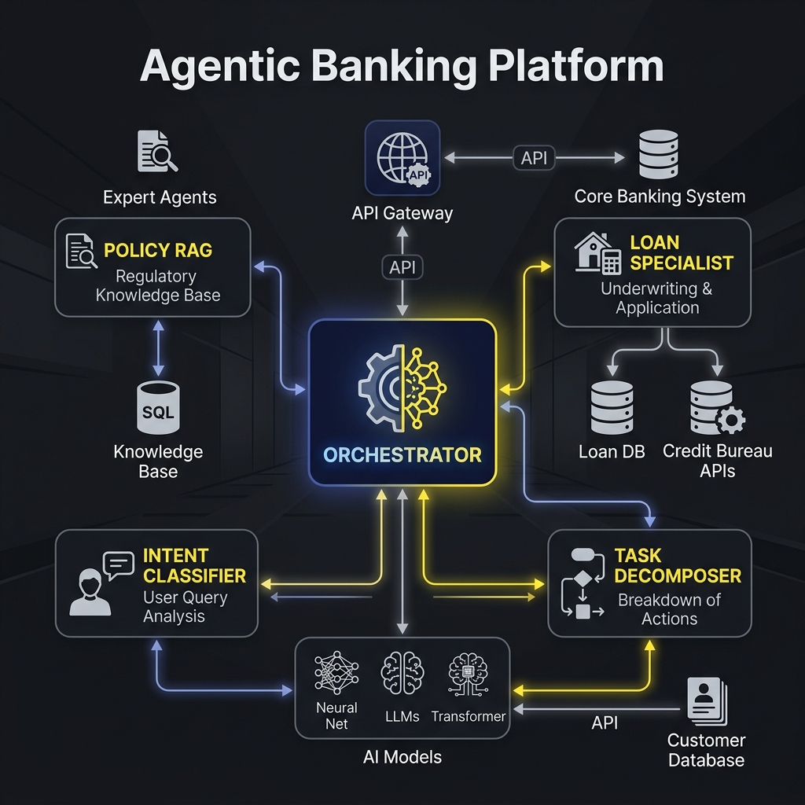
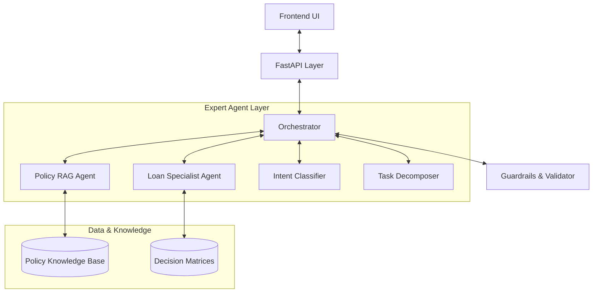

# Agentic Banking Platform: System Architecture & Flow

This document provides a comprehensive technical overview of the architecture powering the Agentic Banking Platform. It details the interaction between the UI, the Orchestration layer, and the specialized domain agents.

## 1. High-Level Architecture

The platform follows a **Hub-and-Spoke** agentic model, where a central "Orchestrator" manages state, memory, and dispatching.





---

## 2. The Reasoning Loop (ReAct Pattern)

The Orchestrator uses a **Reason-Action-Observation** loop to handle complex, multi-stage queries.

1.  **Input Parsing**: The system receives raw natural language.
2.  **Reasoning**: The Orchestrator analyzes the query.
3.  **Action (Agent Call)**: The Orchestrator selects a "Tool" (e.g., `consult_policy_expert`) and generates the necessary parameters.
4.  **Observation**: The specialized agent returns data (e.g., "Defaulters are ineligible for restructuring").
5.  **Synthesis**: The Orchestrator combines observations. If complete, it generates the final answer; otherwise, it loops back to step 2.

---

## 3. Data Flow & Audit Trail

Every step of the reasoning loop is captured in a structured `audit_trail` object, which is sent back to the UI for visualization.

### Audit Schema Example
```json
{
  "step": 3,
  "call_type": "model",
  "agent": "PolicyRAGAgent",
  "action": "Domain Consultation",
  "summary": "Retrieved reapplication policy (Section 3)",
  "output": "..."
}
```

---

## 4. Key Components

### A. The Orchestrator
The "Generalist" that understands context and maintains the conversation flow. It is optimized for high-reasoning tasks and handles final synthesis.

### B. Specialized Agents
Expert models optimized for specific domains. These agents perform the "heavy lifting" of searching documents or calculating loan math.

### C. The "Agent Thought Graph" (UI)
A real-time rendering engine that parses the `audit_trail`. It uses a horizontal timeline layout with adaptive spacing to show the sequential "chain of thought" to the user, providing full transparency on how the AI reached its conclusion.

---

## 5. Deployment & Scalability
- **Backend**: Python (FastAPI).
- **Inference**: High-performance inference engine for ultra-low latency reasoning.
- **Frontend**: Lightweight Vanilla JS for maximum rendering performance of the complex graph structure.
