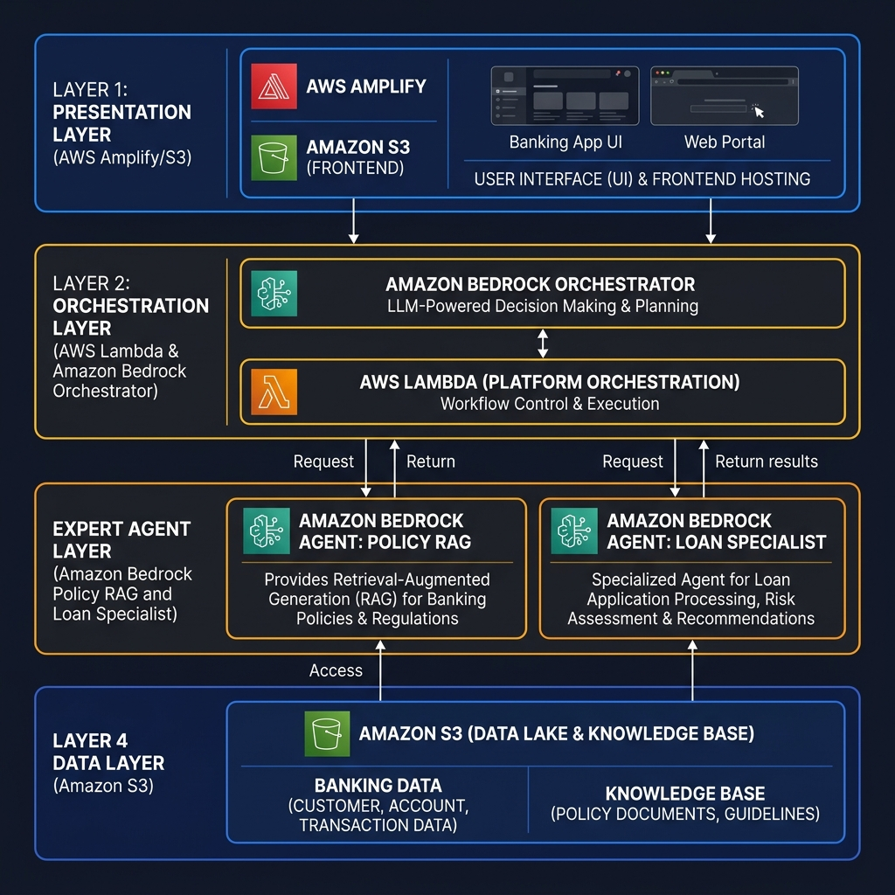

# Agentic Banking Platform: Layered AWS Architecture

This document presents the AWS cloud architecture for the Agentic Banking Platform, organized into the same functional layers as the original system design.

## 1. Layered Architecture (AWS)

### Layer 1: Presentation (UI)
- **AWS Service**: **Amazon S3 + Amazon CloudFront** (or AWS Amplify).
- **Role**: Serves the static HTML/JS/CSS frontend. CloudFront provides global low-latency delivery and SSL termination.

### Layer 2: Orchestration (The Brain)
- **AWS Service**: **AWS Lambda** and **Amazon Bedrock**.
- **Role**: Handles API requests via API Gateway. The Lambda function executes the core orchestrator logic, which uses Amazon Bedrock for high-level reasoning, intent classification, and task decomposition.

### Layer 3: Expert Agents
- **AWS Service**: **Amazon Bedrock**.
- **Role**: Specialized agent instances (Policy RAG and Loan Specialist) execute domain-specific tasks. They leverage Bedrock's serverless inference to process data and generate observations.

### Layer 4: Data & Knowledge
- **AWS Service**: **Amazon S3**.
- **Role**: Stores the ground-truth policy documents and knowledge bases that the RAG agents consult during reasoning.

---

## 2. Implementation Summary
By maintaining this layered approach on AWS, the platform achieves:
- **Separation of Concerns**: Each layer can be scaled and secured independently.
- **Serverless Efficiency**: All layers (S3, Lambda, Bedrock) are serverless, ensuring costs only scale with actual usage.
- **Enterprise Security**: Native AWS integration ensures banking-grade encryption at rest (S3) and in transit (API Gateway).
